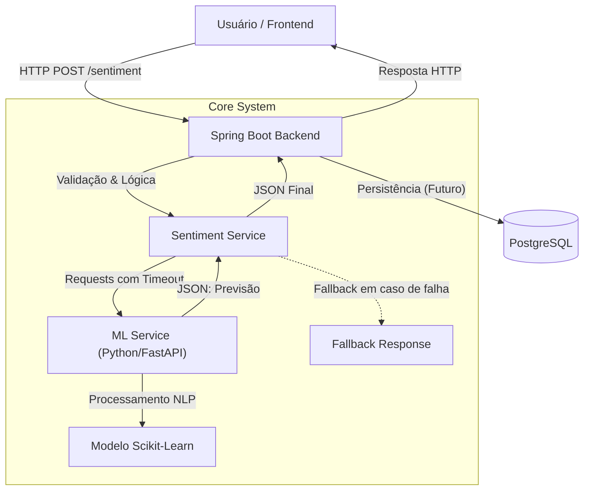

# 🧠 SentimentAPI

Bem-vindo ao **SentimentAPI**, uma solução completa e robusta de análise de sentimentos desenvolvida para o Hackathon Acadêmico. 

Este projeto integra um **Backend resiliente** em Java (Spring Boot), um **Microsserviço de Machine Learning** em Python (FastAPI + Scikit-Learn) e um **Frontend moderno** (Next.js), todos orquestrados via Docker para garantir consistência e facilidade de implantação.

---

## 🏗️ Arquitetura do Sistema

O sistema foi desenhado priorizando a **resiliência** e o **desacoplamento**. O Backend atua como orquestrador, garantindo que a aplicação continue funcional mesmo se o serviço de ML estiver temporariamente indisponível.



### Componentes Principais

| Componente | Tecnologia | Função |
|------------|------------|--------|
| **Backend** | Java 17, Spring Boot 3 | API Gateway, validação de segurança, orquestração e **resiliência** (Fallback Pattern). |
| **ML Service** | Python 3.10, FastAPI | Pré-processamento de texto (NLP), execução do modelo de Machine Learning e explicabilidade dos dados. |
| **Frontend** | React, Next.js | Interface de usuário para interação com a API. |
| **Infraestrutura** | Docker Compose | Orquestração de containers e rede interna. |

---

## ✨ Funcionalidades Chave

### 1. Pipeline de NLP Avançado
O serviço de ML não apenas roda um modelo, ele entende o contexto do idioma informal da internet:
- **Demojização**: Transforma emojis em texto (ex: "👍" vira ":thumbs_up:").
- **Tratamento de Negação**: Entende que "não gostei" é o oposto de "gostei" (sufixação de contexto).
- **Limpeza Inteligente**: Remove ruídos mantendo a pontuação expressiva (!, ?).

### 2. Resiliência e Alta Disponibilidade
O Backend foi projetado para **nunca falhar** silenciosamente:
- Se o serviço de ML cair, o backend retorna uma resposta de **Fallback** ("Indefinido") com metadados explicativos.
- O sistema usa timeouts configurados para evitar travamentos em cascata.

### 3. Independência de Modelo
O contrato de API entre Backend e ML Service é flexível. O time de Data Science pode evoluir o modelo, adicionar novos campos de retorno ou mudar a biblioteca de ML sem quebrar o Backend.

---

## 🔗 Acesso ao Deploy do Projeto

Este projeto está hospedado na **Oracle Cloud Infrastructure (OCI)** e possui Frontend com autenticação via tela de login.

### URL de acesso

- http://163.176.145.187:3000/

### Credenciais de acesso

Utilize as credenciais abaixo para acessar o sistema:

```text
Login: testes 
Senha: 123456
```

> ⚠️ *Atenção:
Estas credenciais são exclusivas para fins de avaliação no hackathon e poderão ser desativadas ou alteradas após o encerramento do evento.*

### Processo de login

1. Acesse a URL do projeto acima
2. Informe o **usuário** e a **senha** acima
3. Após o login, o usuário terá acesso às funcionalidades disponíveis no sistema

---

## 🚀 Como Rodar Localmente (Quick Start)

A maneira recomendada de rodar o projeto localmente é utilizando **Docker Compose**. Isso garante que todas as dependências (Java, Python, Bancos de Dados) estejam isoladas e configuradas corretamente.

### Pré-requisitos
- [Docker Desktop](https://www.docker.com/products/docker-desktop/) instalado e rodando.

### Passo a Passo

1. **Clone o repositório:**
   ```bash
   git clone https://github.com/seu-usuario/SentimentAPI.git
   cd SentimentAPI
   ```

2. **Inicie a aplicação:**
   ```bash
   docker compose up --build
   ```
   > ☕ *A primeira execução pode demorar alguns minutos enquanto as imagens são baixadas e construídas.*

3. **Acesse os serviços:**
   - **Backend API**: [http://localhost:8080](http://localhost:8080)
   - **Documentação ML (Swagger)**: [http://localhost:8000/docs](http://localhost:8000/docs)
   - **Frontend**: [http://localhost:3000](http://localhost:3000) (se iniciado)

4. **Para parar:**
   Pressione `Ctrl+C` ou rode:
   ```bash
   docker compose down
   ```

---

## 📌 Exemplos de requisição e resposta (JSON)

Esta seção apresenta exemplos de chamadas à API, demonstrando o formato das requisições e respostas em JSON.

### 1. Autenticação – Login

**Endpoint:**
```http
POST /login
```

**Request:**
```json
{
   "username": "testes",
   "password": "123456"
}
```

**Response (sucesso 200 OK):**
```json
{
   "token": "<JWT_TOKEN>"
}
```

### 2. Análise de Sentimento (Endpoint Principal)

**Endpoint:**
```http
POST /sentiment/analyze
```

👍 Abaixo é um exemplo do atributo text e previsão **positivas**:  

**Request:**
```json
{
  "text": "O produto chegou rápido e é de ótima qualidade"
}
```

**Response (sucesso):**
```json
{
   "previsao": "Positivo",
   "probabilidade": 0.9138,
   "status": "SUCCESS",
   "principais_palavras": [
      "qualidade",
      "ótima",
      "ótima qualidade"
   ]
}
```

👎 Abaixo é um exemplo do atributo text e previsão **negativas**:

**Request:**
```json
{
  "text": "O produto demorou para chegar e é de péssima qualidade"
}
```

**Response (sucesso):**
```json
{
   "previsao": "Negativo",
   "probabilidade": 0.9822,
   "status": "SUCCESS",
   "principais_palavras": [
      "péssima",
      "péssima qualidade",
      "demorou"
   ]
}
```

Abaixo é um exemplo de fallback quando o modelo ML está indisponível:

**Response:**
```json
{
  "previsao": "Indefinido",
  "probabilidade": 0.0
}
```

### 3. Estatísticas de Uso

**Endpoint:**
```http
GET /stats
```

**Response:**
```json
{
  "Positivo": 5,
  "Negativo": 3,
  "Neutro": 2,
  "Indefinido": 1,
  "Total": 11
}
```

### 4. Health Check

**Endpoint:**
```http
GET /health
```

**Response:**
```json
{
  "status": "UP",
  "timestamp": "2024-01-15T10:30:00Z",
  "ml_service": {
    "status": "UP",
    "url": "http://ml-service:8000/predict"
  }
}
```

### 5. Endpoint de Teste

**Endpoint:**
```http
GET /hello
```

**Response:**
```
Hello World! TESTE
```

---

## 🛠️ Dependências e versões das ferramentas utilizadas

* **Java 17+**
* **Spring Boot 3.x**
* **Spring Web**
* **PostgreSQL 15**
* **Bean Validation (Jakarta Validation 3.0)**
* **Spring Boot Actuator** (para health checks)
* **RestTemplate** (cliente HTTP com timeouts configurados)
* **Docker & Docker Compose** (containerização)
* **FastAPI** (microserviço consumido externamente)
* **SLF4J + Logback** (logging estruturado)
* **Spring Data JPA/Hibernate** (persistência de dados)
* **Spring Security JWT e Auth0 4.2.1** (autorização e autenticação)

---

## 📂 Estrutura do Projeto

```text
/SentimentAPI
├── backend/            # Aplicação Spring Boot (API Gateway & Lógica)
├── ml-service/         # Microsserviço Python (Modelo de IA)
├── frontend/           # Aplicação Next.js (Interface Web)
├── data-science/       # Notebooks de treinamento e exploração de dados
├── docker-compose.yml  # Orquestração dos serviços
└── README.md           # Este arquivo
```

---

## 📚 Documentação Detalhada

Cada módulo possui sua própria documentação técnica detalhada. Recomendamos a leitura para desenvolvedores que desejam contribuir:

- ☕ **[Backend Documentation](./backend/README.md)**: Detalhes sobre endpoints, DTOs, arquitetura de fallback e configurações do Spring.
- 🐍 **[ML Service Documentation](./ml-service/README.md)**: Detalhes sobre o pipeline de pré-processamento, modelo `pkl` e endpoints do FastAPI.
- ⚛️ **[Frontend Documentation](./frontend/sentimentos-api/README.md)**: Guia de desenvolvimento do Next.js.

---

## 🧪 Como Testar Agora Mesmo

Com o projeto rodando (`docker compose up`), você pode testar a análise de sentimento diretamente pelo terminal:

**Teste Positivo:**
```bash
curl -X POST http://localhost:8080/sentiment/analyze \
  -H "Content-Type: application/json" \
  -d '{"text": "O entregador foi super rápido e educado! Adorei."}'
```

**Teste Negativo (com ironia/gíria):**
```bash
curl -X POST http://localhost:8080/sentiment/analyze \
  -H "Content-Type: application/json" \
  -d '{"text": "O produto chegou todo quebrado, parabens aos envolvidos."}'
```

---

## 👥 Autores e Créditos

Este projeto foi desenvolvido como parte do Hackathon ONE II - Brasil, com foco em solução técnica, colaboração em equipe e boas práticas de desenvolvimento de software.

### 👥 Desenvolvido pelas equipes

**Data Science**: Treinamento de modelos, limpeza de dados.
- André Gabos — [GitHub]() | [LinkedIn]()
- Jose Evangelista — [GitHub]() | [LinkedIn]()
- Silvina Sousa — [GitHub]() | [LinkedIn]()

**Backend Engineering**: Arquitetura resiliente, Spring Boot.
- Camila Lopes — [GitHub](https://github.com/camlopes) | [LinkedIn](www.linkedin.com/in/camila-lopes00)
- Rick Clayton — [GitHub]() | [LinkedIn]()
- Victor Manuel — [GitHub]() | [LinkedIn]()

**Frontend Development**: UI/UX, Next.js.
- Jose Evangelista — [GitHub]() | [LinkedIn]()

### 🤝 Créditos e Agradecimentos

Agradecimentos especiais a:
- Organização do hackathon pelo suporte e oportunidade
- Mentores e avaliadores pelas orientações
- Comunidade open source pelas ferramentas e bibliotecas utilizadas 
